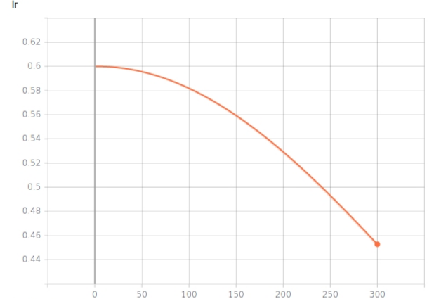
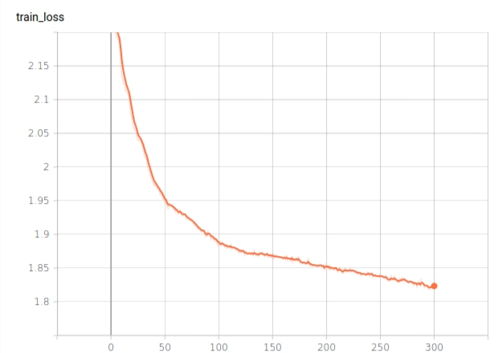
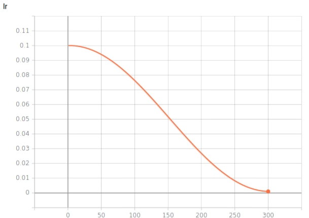
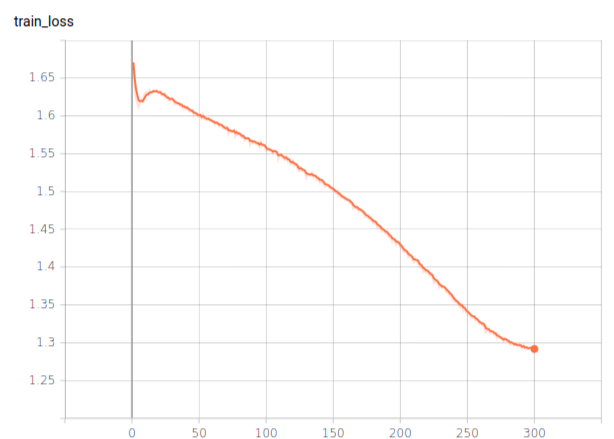

# SupCos

This repo is for implementation of:
- Supervised Contrastive Learning: [Paper](https://arxiv.org/abs/2004.11362)

## Dependencies
- PyTorch 1.4.0 
- Torchvision 0.5.0
- CUDA 10.0, cuDNN 7.5.1

## How to use
Please be careful for the `batch_size` option: adjust it depending on your GPU memory. \
Learning rate may not be optimized that much... (Processing) \

#### Baseline model training and validation (ResNet50)
```
python main_baseline.py --batch_size 128 --lr 0.75 --epochs 600
```

#### Supervised Contrastive model: Stage 1(embedding + projection) training and validation
```
python main_embed.py --batch_size 128 --lr 0.6 --epochs 700
```

#### Supervised Contrastive model: Stage 2(classifier) training and validation
```
python main_linear.py --batch_size 128 --lr 1 --epochs 100
```

## Dataset
CIFAR10 for default, more dataset experiment coming soon

## Augmentation
[AutoAugment](https://arxiv.org/abs/1805.09501) is set by default. You can change it to manual by giving option:
```
--augment Basic
```

## Performance result
Training result on stage1 model : ResNet50 encoder + projection layer) \
I ran two seperate sequence learning for stage1 model, and then trained linear classifier.

- First learning for stage1: Lr=0.6 with cosine annealing, epochs=300, SGD optimizer \


- Second learning for stage1: Lr=0.1 with cosine annealing, epochs=300, SGD optimizer \


\
- Training for stage2 linear classifier: Lr=5(but this seems not that good value, will be updated soon) with cosine annealing, epochs=100, SGD optimizer \
Got **95.4%** top-1 accuracy on CIFAR10 dataset till now, still tuning for best result (96%+)


## References
[1] Supervised Contrastive Learning: [Paper](https://arxiv.org/abs/2004.11362) \
[2] AutoAugment: [Github](https://github.com/4uiiurz1/pytorch-auto-augment)
